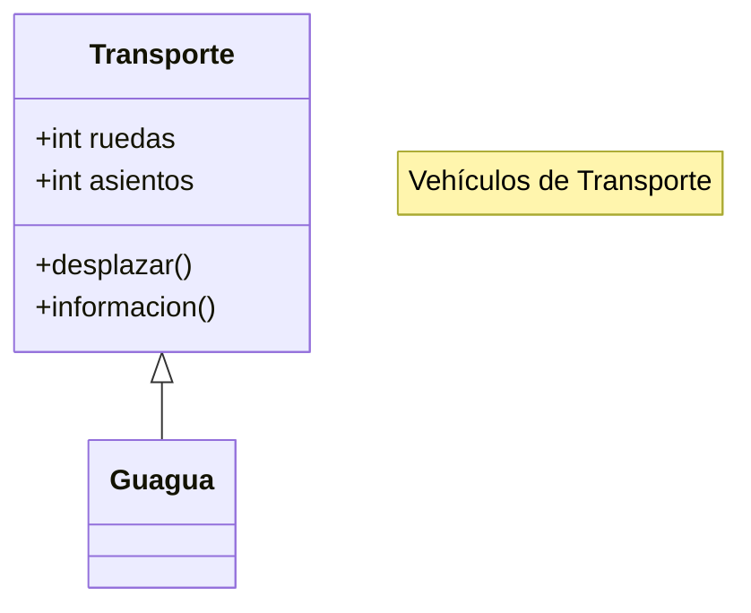
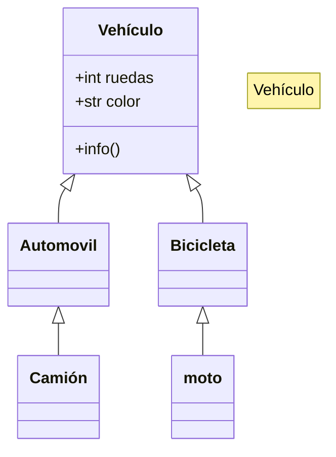

## Ejercicio 1

- intercity = Guagua
- lanzaroteBus = Guagua

## Ejercicio 2

## Ejercicio 3
Escribir una clase que convierta un número entero en número romano

opción b: número romano a número entero